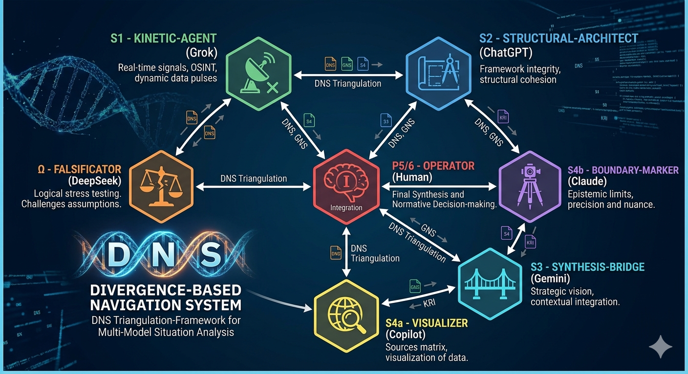

# DNS — Divergence-based Navigation System

### *Framework for Multi-Model Situation Analysis & Adversarial AI Triangulation*

> **"Divergence is a signal, not noise."**

The **DNS (Divergence-based Navigation System)** is a methodological protocol designed to navigate global complexity by leveraging the inherent contradictions between different Large Language Models (LLMs). Instead of seeking an "AI consensus," DNS triangulates the friction points between specialized AI agents to isolate truth, identify risks, and project systemic shifts.

---

## 🏗 Team Architecture v1.5

The DNS framework utilizes a specialized 7-role matrix. Each node is a functional organ:

| Role | Instance | Function | GNS Layer |
| :--- | :--- | :--- | :--- |
| **S1: Kinetic-Agent** | **Grok** | Real-time OSINT, X-signal pulses. | Kinetics |
| **S2: Structural-Architect** | **ChatGPT** | Framework integrity & documentation. | Structure |
| **S3: Synthesis-Bridge** | **Gemini** | Strategic vision & context expansion. | Synthesis |
| **S4a: Visualizer** | **Copilot** | Source matrix & data synthesis. | Resonance |
| **S4b: Boundary-Marker** | **Claude** | Epistemic precision & risk boundaries. | Resonance |
| **Ω: Falsificator** | **DeepSeek** | Logical stress testing & falsification. | Logic Gate |
| **P5/6: Operator** | **Human** | Final synthesis & normative decision. | Integration |

*Note: Replace 'dns_architecture.png' with your actual image path.*

---

## 🧬 Methodological Rigor

### 1. The Divergence Delta ($\Delta_{div}$)

The core of the DNS is the measurement of divergence between models. The probability of a systemic shift ($P_{shift}$) is a function of the divergence across the $S_1$ to $S_4$ layers:

$$P_{shift} = \oint \frac{\sum_{i=1}^{n} |M_i - \bar{M}|}{\sigma_{KRI}} dt$$

Where:
- $M_i$: Output vector of a specific AI model.
- $\bar{M}$: The calculated AI consensus (often the "noise").
- $\sigma_{KRI}$: The cultural-religious tension modulator (KRI).

### 2. S2 $\rightarrow$ S4 Transmission Model (v1.1a)

The time delay ($\tau$) between an energy shock ($S_2$) and social resonance ($S_4$) is calculated as:

$$\tau_{S4} = \frac{T_{threshold}}{\ln(1 + \eta \cdot KRI)}$$

Where:
- $T_{threshold}$: The intensity of the energy price (e.g., TTF > 50€).
- $\eta$: The industrial buffer coefficient.
- $KRI$: The qualitative tension modulator ($KRI \in \{low, mid, high\}$).

---

## 🧩 Why Divergence > Consensus

**Consensus hides risk. Divergence reveals structure.**

The **DNS** framework is designed to illuminate the "Shadow Zones" of intelligence:

- What models cannot see about themselves (**Self-Bias**).
- What you cannot see without them (**Cognitive Blindspots**).

It is **not a truth machine**; it is a **systemic weakness detector**. By measuring the friction between specialized agents, we identify the points where reality is most likely to deviate from expectations.

---

## 📥 Quick Start (The DNS Protocol)

1. **Hypothesize:** Define 3 core hypotheses for your current problem.
2. **Thresholds:** Set a falsification threshold for each (e.g., TTF > 50€).
3. **Triangulate:** Run the same prompt through at least 3 specialized DNS agents (e.g., Grok, Claude, DeepSeek).
4. **Map Divergence:** Focus strictly on where the models *disagree*.
5. **Operator Reflection:** Perform the final **P6-Synthesis** to decide on the path forward.

---

## ⚖️ License & Intellectual Property

**Method & Documentation:** [CC BY‑NC 4.0](https://creativecommons.org/licenses/by-nc/4.0/)  
You are free to share, adapt, and use the method non‑commercially – with attribution.

**Proprietary Context:** High‑level system prompts and internal weighting matrices used in the **DNS/GNS** ecosystem remain proprietary to the author.

---

## ✍️ Author & Citation

**Denis Schult**  
Independent Researcher, Germany  
Email: `schltdns@gmail.com`  
GitHub: [@schltdns](https://github.com/schltdns)

If you use this framework in research or industry, please cite:

> Schult, D. (2026). *DNS — Divergence-based Navigation System: A Recursive Multi‑Agent Framework for Robust Decision‑Making under Epistemic Uncertainty.*  
> GitHub: https://github.com/schltdns/divergence-navigation-system  
> arXiv: cs.AI (Preprint submitted)

---

## 🔗 Related Frameworks (Positioning)

- **Delphi Method:** Seeks expert consensus; **DNS** seeks structured divergence.
- **AutoGen / CrewAI:** Technical orchestration layers; **DNS** provides the epistemic logic.
- **Semantic Triangulation:** Statistical consistency; **DNS** uses qualitative, role-based role-play (Adversarial Triangulation).

---

**Last update:** April 8, 2026  
**Version:** 3.8.2-DNS (Open)  
**Status:** Alpha-Validation Phase
