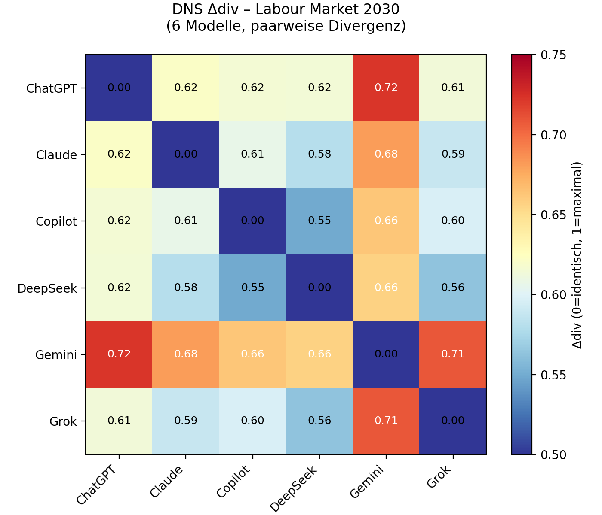

# DNS Case Study: Labour Market 2030 – AI Automation & Skills Shortage

**Part of the DNS (Divergence-based Navigation System) repository – Version 2.1**

> **"This case study does not show what AI says – it reveals where and why AI models disagree, and how reasoned decisions are derived from that divergence."**

---

## What this case study is

This folder documents a **structured, falsifiable, multi-model analysis** of the German labour market up to 2030 under AI automation, following the DNS Protocol P1-P8.

1. **Demonstration of the DNS method** – how to apply P1-P8, extract divergence, use the power layer, and produce a transparent synthesis
2. **Substantive contribution** – a robust, empirically grounded synthesis of expected labour market transformations

**Measurement basis:** Δdiv = **0.6256** (Jaccard mean 0.1923, Cosine mean 0.5564) across six models – ChatGPT, Claude, Copilot, DeepSeek, Gemini, Grok. Highest pairwise divergence: ChatGPT ↔ Gemini (0.7221). Lowest: Copilot ↔ DeepSeek (0.5492).

---

## Repository structure (P1-P8)

| File / Folder | Protocol | Content |
|---|---|---|
| [01_hypothesis.md](./01_hypothesis.md) | P1 | Research question, A-G dimensions, scope |
| [02_thresholds.md](./02_thresholds.md) | P2 | Falsification criteria, Δdiv thresholds |
| [03_outputs/](./03_outputs/) | P3 | Raw, unedited responses from 6 models (audit trail) |
| [04_divergence_map.md](./04_divergence_map.md) | P4 | Divergence types, matrix, where/why models disagree |
| [05_synthesis.md](./05_synthesis.md) | P5 | Weighted synthesis, Master Frame 3.3, consensus findings |
| [09__operator_synthesis.md](./09__operator_synthesis.md) | P5b | Operator's normative decision (automate faster, lean regulation) |
| [06_validation.md](./06_validation.md) | P6 | External checks (IAB, WEF, IW, McKinsey, BAuA) |
| [06b_power_layer.md](./06b_power_layer.md) | P6b | Who controls, who accesses, who profits, who bears risks |
| [07_reflection.md](./07_reflection.md) | P7 | Operator decisions, biases, limitations, transparency log |
| [08_manifest.json](./08_manifest.json) | P8 | Run manifest, IPFS CID, SHA256, reproducibility |
| [dns_heatmap_labour_2030.png](./dns_heatmap_labour_2030.png) | – | Visual Δdiv heatmap |
| [changelog.md](./changelog.md) | – | Version history |

---

## Key findings

**Consensus:**
- Job change > job loss; productivity potential 0.3–1.2% p.a. *if* organisational adaptation happens
- Skill shift inevitable; dual training is an advantage if modernised
- Social risks are real and unequally distributed

**Divergences (open):**
- **Speed:** gradual (ChatGPT, Gemini) vs exponential (Claude, DeepSeek)
- **Regulation:** brake on innovation vs protection for workers
- **Social mobility:** democratisation vs erosion of entry jobs
- **Mental health:** relief vs chronic stress

**Master question:** Does technology scale faster than social systems can adapt?

**Operator decision:** Automate faster, reskill consistently, keep regulation lean – see [09__operator_synthesis.md](./09__operator_synthesis.md)

**Falsification:** Testable criteria in [05_synthesis.md](./05_synthesis.md) (e.g., productivity <0.1% by 2028 falsifies optimistic thesis)

---

## How to use

- **For researchers:** Replicate with your own models. Compare your Δdiv pattern with ours in [04_divergence_map.md](./04_divergence_map.md)
- **For practitioners:** Use the three filters (adoption, qualification, institutions) plus power layer from [05_synthesis.md](./05_synthesis.md) and [06b_power_layer.md](./06b_power_layer.md)
- **For method developers:** Build on the divergence measurement and falsification matrix

---

## Open Data

- **IPFS:** see [08_manifest.json](./08_manifest.json)
- **Zenodo DOI:** 10.5281/zenodo.19597808
- **License:** Code Apache-2.0, Docs CC-BY-NC-SA-4.0

---

## Citation

Schult, D. (2026). *DNS (Divergence-based Navigation System): Labour Market 2030 Case Study v2.1*. GitHub. https://github.com/schltdns/divergence-navigation-system

---

**Last updated:** April 2026  
**Maintainer:** Denis Schult
