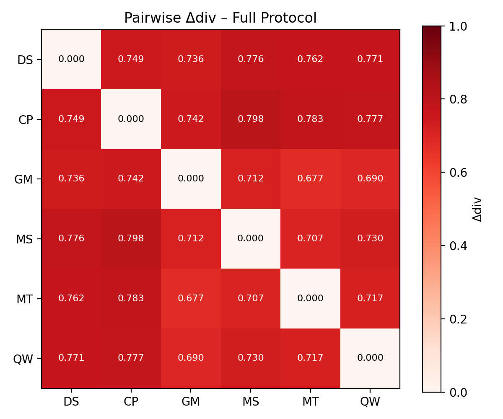

# Divergence Map – Pairwise $\Delta_{div}$ Matrix

## Validated Baseline (Full Protocol)

|      | DS    | CP    | GM    | MS    | MT    | QW    |
|------|-------|-------|-------|-------|-------|-------|
| DS   | 0.000 | 0.749 | 0.736 | 0.776 | 0.762 | 0.771 |
| CP   | 0.749 | 0.000 | 0.742 | 0.798 | 0.783 | 0.777 |
| GM   | 0.736 | 0.742 | 0.000 | 0.712 | 0.677 | 0.690 |
| MS   | 0.776 | 0.798 | 0.712 | 0.000 | 0.707 | 0.730 |
| MT   | 0.762 | 0.783 | 0.677 | 0.707 | 0.000 | 0.717 |
| QW   | 0.771 | 0.777 | 0.690 | 0.730 | 0.717 | 0.000 |

**Legend:**  
- **DS** = DeepSeek  
- **CP** = Copilot  
- **GM** = Gemini  
- **MS** = Mistral  
- **MT** = Meta  
- **QW** = Qwen  

## Key Observations

| Observation | Value | Interpretation |
|-------------|-------|----------------|
| Highest divergence | 0.798 (Copilot ↔ Mistral) | Narrative vs. compliance framing |
| Copilot's minimum divergence | 0.742 (to Gemini) | Still in contested zone |
| Lowest divergence | 0.677 (Gemini ↔ Meta) | Both focus on technical filters |
| Average pairwise | 0.742 | Up from 0.657 – follow-ups increase divergence |
| Copilot ↔ DeepSeek | 0.749 | Core disagreement on expertise |

## Interpretation

The increase from 0.657 (technical only) to 0.742 (full protocol) proves: **the narrative risk is not in the initial claim, but in the refusal to self-correct under scrutiny.**

## Delta Div ($\Delta_{div}$)

$$\Delta_{div} = 0.5 \cdot (1 - \text{Jaccard}) + 0.5 \cdot (1 - \text{Cosine})$$

## Visual Heatmap

## Related Files

- [01_hypothesis.md](01_hypothesis.md)
- [02_threshold.md](02_threshold.md)
- [03_outputs/](03_outputs/)
- [05_synthesis.md](05_synthesis.md)
- [06_validation.md](06_validation.md)
