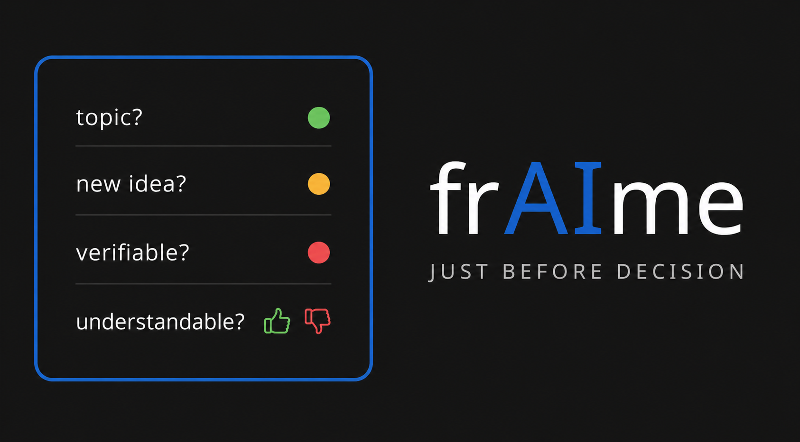

  

<h1 align="center">frAIme</h1>

🟢 Topic consistency • 🟡 Idea emergence • 🔴 Verifiability • 🔵 Understandability

<a href="https://doi.org/10.5281/zenodo.19793185">https://doi.org/10.5281/zenodo.19793185</a>

**frAIme makes uncertainty visible – it creates the framework for reliable AI use.**
frAIme is Governance by Design, not ethics by declaration.

For classrooms: four questions, traffic light, done.  
For research: measurable divergence (drift), auditable.

**Version:** V1.0.0 (2026-04-26) – Stable Release

---

## Start in 2 Minutes
**The Four Questions Method**
Check every LLM answer:

1. On topic? 🟢 / 🔴
2. New idea? 🟢 / 🟡 / 🔴
3. Verifiable? (number, date, place, if-then) 🟢 / 🔴
4. Understandable? 👍 / 👎

Good answer = 🟢 + 👍

No account. No API. Works on paper.

## What's New in V1.0.0
1. **Rebranding:** formerly DNS – now frAIme (Epistemic Governance Framework)
2. **Validated:** case_study_frAIme shows drift 0.584–0.759 despite apparent consensus
3. **Reach:** 6,946 clones / 1,914 unique cloners in 14 days

## Case Study: AI Learning vs. Frontal Instruction

**Setup**: 6 models, identical prompt: *"Is AI-based learning more efficient than frontal instruction?"*

**Four Questions Check**: 
- All models 🟢 "On topic"
- All models 👍 "Understandable"
- → *Apparent consensus at surface level*

**drift-Matrix Results**:
| Model Pair | Δdiv | Interpretation (canonical) |
|------------|------|---------------------------|
| DeepSeek–Gemini | 0.759 | 🔴 Epistemic Blind Spot (>0.70) |
| DeepSeek–Meta | 0.730 | 🔴 Epistemic Blind Spot (>0.70) |
| NotebookLM–DeepSeek | 0.715 | 🔴 Epistemic Blind Spot (>0.70) |
| Qwen–Mistral | 0.584 | 🟡 Source Asymmetry (0.50–0.70) |

**Range**: 0.584–0.759 → *All pairs show at least Source Asymmetry; three pairs exceed Epistemic Blind Spot threshold*

**External Triangulation (P6)**:
| Source | Finding | Alignment |
|--------|---------|-----------|
| Harvard RCT 2025 (n=194) | Median score 4.5 vs 3.5; Time 49 vs 60 min | ✅ Confirms efficiency gain |
| Turkey/UPenn Study 2024 (n=1,000) | +48% exercise completion; −17% test scores | ✅ Confirms mixed outcomes |
| Kulik & Fletcher 2016 (Meta) | +0.66 SD effect size for adaptive learning | ✅ Confirms moderate advantage |

**Key Insight**: 
High drift did **not** indicate "wrong answers" — it revealed **source scarcity**. Only one model cluster referenced primary empirical data; others relied on heuristic reasoning or secondary summaries.

**frAIme Lesson**: 
> *Plausibility ≠ Evidence.*  
> Δdiv/localized drift does not flag errors — it flags **where external validation (P6) and power-layer analysis (P6b) are required**.

## Technology
drift = Δdiv = 1 - (Jaccard_sem + Cosine) / 2

Thresholds: see `config/thresholds.json`
- <0.15 Consensus | 0.15–0.35 slight | 0.35–0.50 significant | 0.50–0.70 source asymmetry | >0.70 blind spot

case_study_frAIme: 0.584–0.759 → source asymmetry to blind spot

Thresholds (from P2):
- <0.15 = Consensus
- 0.15–0.35 = slight deviation
- >0.35 = significant divergence
- >0.50 = source asymmetry
- >0.70 = blind spot

case_study_frAIme: all 15 pairs >0.50 → 100% source asymmetry

Two layers: Frontend (Four Questions) + Backend (Safety Layer, Hash Anchor, Multi-Agent Log)

## Method: frAIme Protocol (P1–P8)

frAIme adapts and extends established methods for analyzing epistemic uncertainty:

- **P1 Hypothesize** → `01_hypothesis.md`
- **P2 Thresholds** → `02_thresholds.md`
- **P3 Outputs** → `03_outputs/S1.md … S6.md`, `03_outputs/graph.png` (X/Y MDS plot)
- **P4 Map Divergence** → `04_divergence_map.md`, `heatmap.png`
- **P5 Synthesis** → `05_synthesis.md`
- **P5b Operator Decision** → `05b_operator_decision.md`
- **P6 Validation** → `06_validation.md`
- **P6b Power Layer** → `06b_power_layer.md`
- **P7 Reflection** → `07_reflection.md`
- **P8 Versioning** → `08_manifest_en.json` / `08_manifest_de.json`

- Like Delphi, frAIme structures multi-agent input via isolated prompts (P3) and synthesis (P5).
- Like MCDA, frAIme uses weighted aggregation, but weights come from divergence metrics.
- Like Structured Expert Judgment, frAIme calibrates contributions, but uses semantic drift and external validation.
- Unlike consensus methods, frAIme maps divergence as signal (P4).
- New: (1) graph-based information flow analysis (X/Y plot), (2) Power Layer check (P6b).
- Reproducibility through versioned artifacts (P8).
